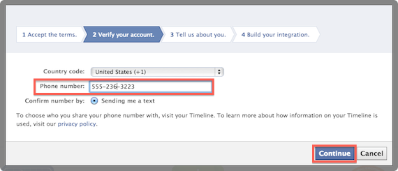
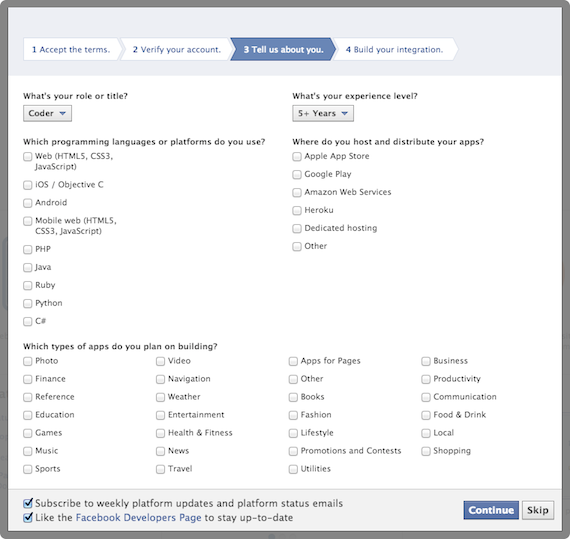
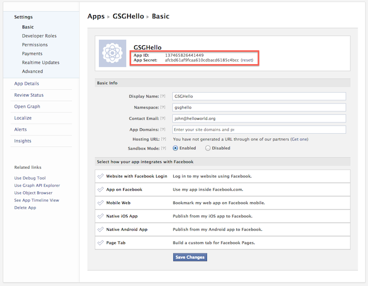

Getting Started: Registering an Application with Facebook
========================================================
This Getting Started guide will walk you through the steps of registering an application to integrate with Facebook.

The steps in this guide will all be performed in your web browser on Facebook.com. Although we'll not be writing any code in the course of this guide, we have provided a simple utility project you can use to verify that you performed the steps correctly. Instructions for getting and running the utility will be at the end of this guide.

Becoming a Facebook Developer
-----------------------------
In order to be a Facebook developer, you must first be a Facebook user. If you do not already have an account with Facebook, go to http://facebook.com and register. The registration form should be one of the first things you see.

To go from Facebook user to Facebook developer, you'll need to go to http://developers.facebook.com. From there, click the "Register Now" button at the top.


Facebook will then walk you through a series of dialogs:

__1.__ Accept the terms: You must accept the terms of Facebook's Platform Policy and Facebook's Privacy Policy.    


__2.__ Verify your account: You must provide a mobile number through which Facebook will verify that you're not using automated means of setting up multiple developer accounts. Facebook will text you a verification code that you must enter to proceed with registration. 




__3.__ Tell us about you: Facebook wants to know a little bit about you as a Facebook application developer.



> **Note:** You might get prompted with the option to receive more text messages. You don't have to turn this on to register a Facebook app. Simply click **Continue** to move on to the next step.

__4.__ Congralations! You're now a Facebook developer.


 
After you've gone through the process to register as a Facebook developer, you're ready to register a new application.

Registering a New Application
-----------------------------
From http://developer.facebook.com, click on the "Apps" menu item at the top of the page. This will take you to the application dashboard where you'll see a list of all of the applications you've created. Since you've not created any applications yet, the list will be empty. 

No problem. Click the  button near the top. This will open a dialog that asks you to name your application.


You can name your application almost anything you want. But Facebook does apply a few rules to the name. For example, your application can't be named anything with the words "Face" or "Book" in them.

You'll also be asked to supply an App Namespace. The App Namespace is used for defining custom Open Graph actions as well as for the application's Facebook URL (e.g., "http://apps.facebook.com/{App_Namespace}"). It's important that the App Namespace be longer than 7 characters, contain no capital letters, and be unique among all applications at Facebook.

You'll also have the option of having Facebook automatically arrange hosting for your application at Heroku.

After you click "Continue", Facebook will perform a Captcha check to ensure that you're not setting up applications through some automated process.


Once you've satisfied the Captcha verification and clicked the "Continue" button, your application will be created. The next page you see will be your application's application settings page.



From the application settings page, you can configure various details about your application. The choices you make here depend largely upon what kind of application you plan to build and what you want your application to do. 

The main thing to note from the application settings page is the __App ID__ and __App Secret__ near the top. This pair of values serves as your application's credentials to Facebook. You'll need these to do almost anything with Facebook, including going through the OAuth authorization flow and working with Facebook's Graph API.

Verifying the Registration
--------------------------
One way you can use your newly registered application's App ID and App Secret is to use them in an application that retrieves information about itself. The sample utility application in GitHub fetches information about a registered application and displays it on the console.

You can clone the utility project from GitHub:

```sh
$ git clone https://github.com/springframework-meta/gs-register-facebook-app.git
```

To run the utility, simply run it from the command line like this:

```sh
$ gradlew run
```

You'll be prompted by two dialogs. The first will ask for the application's App ID and the second will ask for the application's App Secret. You can copy-n-paste those from the Facebook Developer's site.

After supplying the App ID and App Secret, the application will query Facebook's Graph API for a few details about the application. You should see something similar to this on the console from where you launched the app:

```
   APPLICATION DETAILS
=========================
ID:             137465826441449
Name:           GSGHello
Namespace:      gsghello
Contact Email:  john@helloworld.org
Website URL:    null
```

Of course, the exact data will vary based upon the answers given to Facebook when registering your application. The Website URL will be null unless you configure your application as a "Website with Facbeook Login".


Summary
-------
Congratulations! You have now registered an application with Facebook.

This is merely the first step in developing an application that is integrated into its users' social graph.

