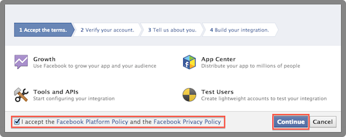
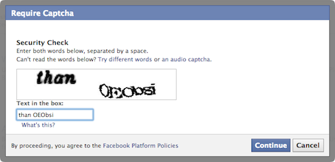

This guide walks you through the steps of registering an application to integrate with Facebook.

You perform these steps in your web browser on Facebook.com. Although you won't be writing code in these steps, you can use a simple utility project to verify that you performed them correctly. Instructions for getting and running the utility are at the end of this guide.

Become a Facebook developer
-----------------------------
If you do not already have an account with Facebook, go to http://facebook.com and register. 

Then go to http://developers.facebook.com, and click Register Now button at the top of the page.


Facebook walks you through a series of dialogs:

__1.__ Accept the terms: Accept the terms of Facebook's Platform Policy and Facebook's Privacy Policy.    



__2.__ Verify your account: Provide a mobile number through which Facebook verifies that you're not using automated means of setting up multiple developer accounts. Facebook texts you a verification code that you enter to proceed with registration. 


__3.__ Tell us about you: Provide brief information about yourself as a Facebook application developer.


> **Note:** You might be given the option to receive more text messages. You don't have to turn this on to register a Facebook app. Click **Continue**.

__4.__ Congralations! You're now a Facebook developer.


 
After you register as a Facebook developer, you can register a new application.

Register a new application
-----------------------------
From http://developer.facebook.com, click on Apps at the top of the page to go to the application dashboard. The dashboard shows a list of applications that the developer has created. You haven't created any applications yet, so the list is empty. 

Click the  button near the top. A dialog prompts you to name your application.


You can name your application almost anything, although Facebook does apply a few rules. For example, the name can't contain the words "Face" or "Book".

You are asked to supply an App Namespace. You use the App Namespace to define custom Open Graph actions and as part of the application's Facebook URL (http://apps.facebook.com/{App_Namespace}). Make sure the App Namespace is longer than 7 characters, contains no capital letters, and is unique among all applications on Facebook. Although it's not required, it's also probably a good idea to provide a namespace that is similar to the name you gave to your application.

Optionally, you can have Facebook automatically arrange hosting for your application at Heroku.

After you click Continue, Facebook performs a Captcha check to verify that you're not setting up applications through an automated process.



Once you've satisfied the verification process, your application is created. The next page you see is your application's application settings page.


From the application settings page, you can configure various details about your application. The choices you make here depend on what kind of application you plan to build and what you want your application to do. 

The main thing to note from the application settings page is the __App ID__ and __App Secret__ near the top. These values are your application's credentials to Facebook. You need these credentials to do almost anything with Facebook, including going through the OAuth authorization flow and working with Facebook's Graph API.

Verify the registration
--------------------------
One way you can use your newly registered application's App ID and App Secret is to use them in an application that retrieves information about itself. The sample utility application in GitHub fetches information about a registered application and displays it on the console.

Clone the utility project from GitHub:

```sh
$ git clone https://github.com/spring-guides/gs-register-facebook-app.git
```

To run the utility, simply run it from the command line using [Gradle][gs-gradle] like this:

```sh
$ ./gradlew clean build && java -jar build/libs/gs-register-facebook-app-0.1.0.jar
```
Or if you are using [Maven][gs-maven], run it like this:
```sh
$ mvn package && java -jar target/gs-register-facebook-app-0.1.0.jar
```
[gs-gradle]: /guides/gs/gradle
[gs-maven]: /guides/gs/maven

A dialog prompts you for the application's App ID, followed by a dialog that asks for the App Secret. Copy and paste them from the Facebook Developer's site.

After supplying the App ID and App Secret, the utility application queries Facebook's Graph API for a few details about your application. You should see something similar to this on the console from which you launched the app:

```
   APPLICATION DETAILS
=========================
ID:             137465826441449
Name:           GSGHello
Namespace:      gsghello
Contact Email:  john@helloworld.org
Website URL:    null
```

Of course, the exact data varies based on the answers you gave to Facebook when you registered your application. The Website URL is null unless you chose to configure your application as a "Website with Facbeook Login".


Summary
-------
Congratulations! You have registered an application with Facebook.

This is the first step in developing an application that is integrated into its users' social graph.

